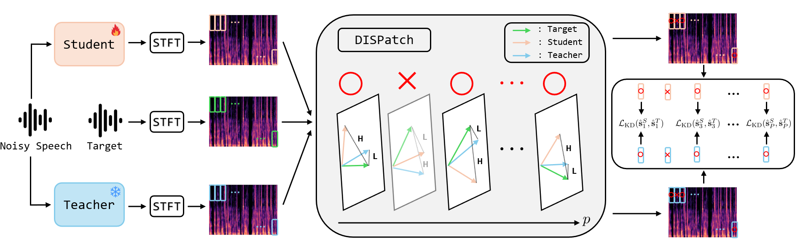
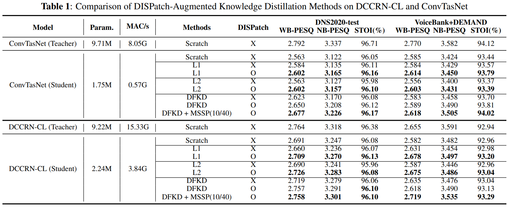

# DISPATCH-DISTILLING-SELECTIVE-PATCHES-FOR-SPEECH-ENHANCEMENT
*In this work, we propose Distilling Selective Patches (DISPatch), a knowledge distillation (KD) framework for speech enhancement. Conventional KD methods often require a compact student model to imitate a high-capacity teacher's output entirely, which can propagate the teacher's errors and yield minimal gains in regions where the student already performs well. To address this, DISPatch selectively applies the distillation loss only to spectrogram patches where the teacher outperforms the student, as measured by a Knowledge Gap Score. This strategy focuses optimization on regions with the most significant potential for improvement, while minimizing influence from regions where the teacher may be unreliable. Furthermore, we introduce Multi-Scale Selective Patches (MSSP), an extension that uses different patch sizes across low- and high-frequency bands to account for spectral heterogeneity. Our experiments show that integrating DISPatch and MSSP into state-of-the-art KD methods consistently and considerably improves the performance of the student model.*

## Overview of DISPatch framework

## Results

